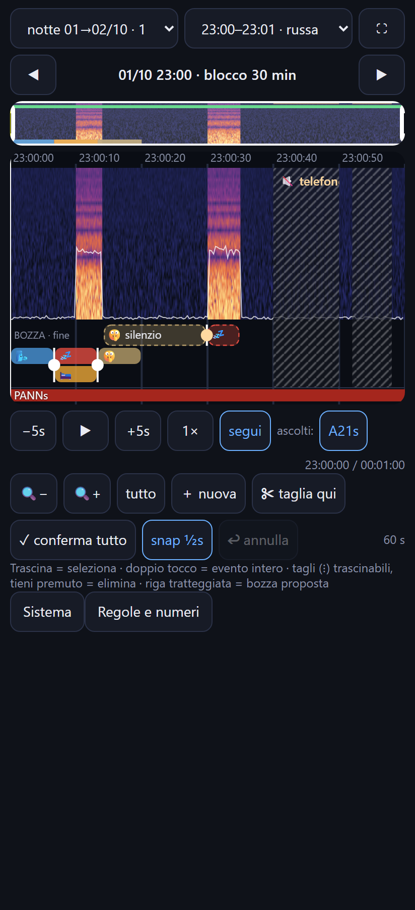
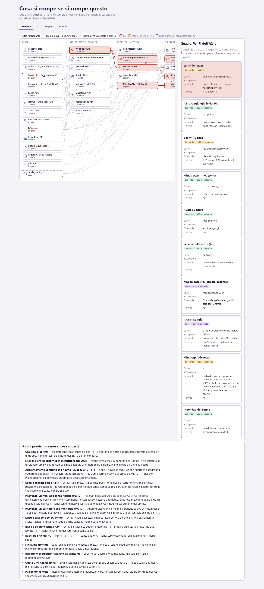
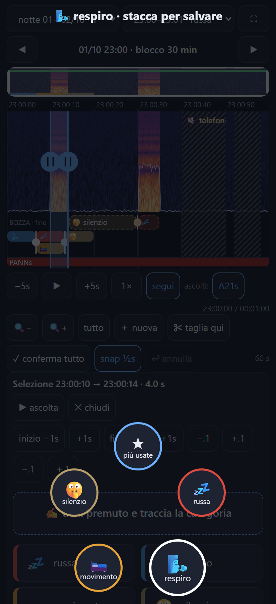

# sonno — registrare e capire il proprio sonno con due telefoni vecchi e un PC

Sistema casalingo che **registra la notte** (audio) con più dispositivi, **riconosce** russare, respiro,
movimenti e risvegli, e manda **una scheda al mattino** su Telegram. Una **Mini App** di Telegram permette di
riascoltare la notte sullo spettrogramma ed etichettare i suoni in pochi secondi.

> Progetto personale, in sviluppo. Non è un dispositivo medico.

## Come è fatto

| Pezzo | Dove gira | Cosa fa |
|---|---|---|
| `bot/rec_*.sh`, `pc/rec_a21s_tel.sh` | telefono principale (Termux) | registra blocchi da 30', prova il microfono prima di ogni blocco |
| `bot/bot.py` | telefono principale | bot Telegram: scheda della notte, note, stato della registrazione |
| `bot/miniapp.py` + `miniapp.html` | telefono principale (tunnel Cloudflare) | Mini App: spettrogramma, ascolto, etichette (anche **a gesto**) |
| `bot/bot_riserva.py`, `bot/note_rapide.py` | secondo telefono | note di riserva quando il principale è spento |
| `pc/guardiano_dispositivi.py` | PC (ogni 2') | controlla i 3 dispositivi, ripara, avvia le riserve, avvisa |
| `pc/kaggle_mattino.py`, `pc/kaggle_notte.py` | PC + Kaggle (GPU) | analisi della notte con PANNs / EfficientAT |
| `pc/sonno_audio.py` | PC | copia dati dai telefoni, analisi del sonno (inizio, fine, risvegli) |
| `bot/grafo_stati.html` | browser | **grafo dei guasti**: cosa si rompe se si rompe un pezzo |

### Etichette a gesto ("come la scrittura a scorrimento della tastiera")

Tieni premuto **✍ traccia**, trascina il dito sulle bolle: le categorie si aprono ad albero
(`movimento` → `letto` → `forte`), **★** propone le combinazioni più usate. Stacchi il dito → salvata.

## Cosa manca / cosa va testato

Stato onesto, dal grafo dei guasti (`bot/grafo_stati.html`, sezione *Rischi*):

**Da fare**
- [ ] **Più tipi di stanchezza** nella previsione del sonno (oggi: orologio interno + pressione del sonno, modello a 2 processi).
- [ ] **Mini App senza server di riserva**: se il telefono principale si spegne, la Mini App è giù (solo le note hanno una riserva).
- [ ] **Allarme sulla tendenza della batteria**: un caricatore debole può dire "in carica" mentre la batteria scende.
- [ ] Kaggle: includere l'audio del PC; controllare che l'audio analizzato non sia silenzio.
- [ ] Buchi tra un file e l'altro nella registrazione del PC.
- [ ] Ora legale (25/10): orari locali senza fuso.
- [ ] rclone: `client_id` condiviso in dismissione → serve un client_id proprio.

**Da testare dal vivo** (provato solo con test automatici)
- [ ] Traccia a gesto **sul telefono vero** (provata in Chromium con Playwright).
- [ ] Bot di riserva acceso davvero dal guardiano durante uno spegnimento del telefono principale.
- [ ] Cancellazione degli avvisi superati (`pc/guardiano_dispositivi.py`, `avvisa()` + `tg_sleepjeans.py --cancella`).
- [ ] Previsione dell'addormentamento confrontata con le notti reali.

**Test automatici**: esistono (Mini App, traccia a gesto nel browser con Playwright, guardiano, analisi della notte),
ma **non sono in questa copia**: usano dati di notti reali.

## Privacy

Questa è una **copia ripulita**: niente audio, niente dati del sonno, niente orari reali, niente token, niente storia dei commit.
Le date-ora rimaste nel codice sono spostate di 12 ore.
Nomi, indirizzi IP (sostituiti con `192.0.2.x`), seriali dei telefoni e percorsi sono segnaposto.
Per farlo girare servono i propri valori: token del bot e chat in un `.env` sul telefono (`TELEGRAM_TOKEN`,
`TELEGRAM_CHAT`), indirizzi dei dispositivi, un remote rclone `gdrive:`.

Controlli fatti prima di pubblicare: scansione con **gitleaks** (nessuna fuga) + ricerca di token, email,
IP privati, seriali, MAC, link Drive, chat id.
